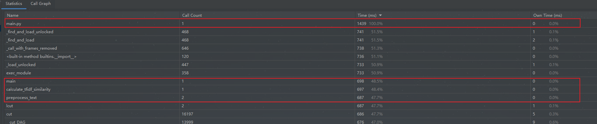
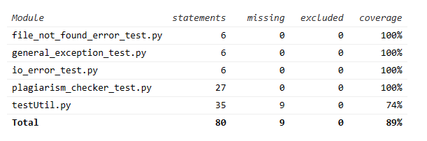

| 这个作业属于哪个课程 | [软件工程](https://edu.cnblogs.com/campus/gdgy/CSGrade22-34)                |
|------------|-------------------------------------------------------------------------|
| 这个作业要求在哪里  | [论文查重](https://edu.cnblogs.com/campus/gdgy/CSGrade22-34/homework/13229) |
| 这个作业的目标    | 提高编程能力、学习使用代码分析和性能测试工具和单元测试的实现                                          |

---

# 一、我的作业github链接

[https://github.com/fjc663/fjc663/tree/main/3122004475](https://github.com/fjc663/fjc663/tree/main/3122004475)

---

# 二、PSP表

| PSP2.1                                       | Personal Software Process Stages | 预估耗时（分钟） | 实际耗时（分钟） |
|----------------------------------------------|----------------------------------|-----------------|-----------------|
| **Planning**                                  | 计划                               | 30              | 35              |
| **Estimate**                                  | 估计这个任务需要多少时间                     | 10              | 12              |
| **Development**                               | 开发                               |                 |                 |
| - Analysis                                    | - 需求分析 (包括学习新技术)                 | 60              | 65              |
| - Design Spec                                 | - 生成设计文档                         | 50              | 55              |
| - Design Review                               | - 设计复审                           | 30              | 28              |
| - Coding Standard                             | - 代码规范 (为目前的开发制定合适的规范)           | 20              | 18              |
| - Design                                      | - 具体设计                           | 60              | 63              |
| - Coding                                      | - 具体编码                           | 200             | 210             |
| - Code Review                                 | - 代码复审                           | 40              | 45              |
| - Test                                        | - 测试（自我测试，修改代码，提交修改）             | 50              | 48              |
| **Reporting**                                 | 报告                               |                 |                 |
| - Test Report                                 | - 测试报告                           | 20              | 22              |
| - Size Measurement                            | - 计算工作量                          | 10              | 8               |
| - Postmortem & Process Improvement Plan       | - 事后总结, 并提出过程改进计划                | 20              | 25              |
|                                   | **合计**                           | **600**         | **634**         |

---

# 三、计算模块接口的设计与实现过程
## 模块划分
整个系统可以分为以下几个模块：
- **文本预处理模块**：负责文本的分词与清洗。
- **相似度计算模块**：使用 TF-IDF 和余弦相似度计算论文的相似度。
- **文件操作模块**：负责读取输入文件和输出查重结果文件。
- **主程序模块**：负责调用各个模块，并进行输入输出的处理。

## 模块设计

### 1. 文本预处理模块
这个模块的功能是对输入的原始文本进行处理，包括中文分词、去停用词等操作。模块结构上可以是一个独立的函数 `preprocess_text`，在需要的时候被调用。

- **输入**：原始文本字符串
- **输出**：预处理后的文本字符串

### 2. 相似度计算模块
这个模块负责核心的相似度计算，使用 TF-IDF 向量化文本并通过余弦相似度公式计算两个文本的相似度。这个模块可以包含一个主函数 `calculate_tfidf_similarity`，该函数接收两个文件路径，并返回计算后的相似度。

- **输入**：两个文本文件的路径
- **输出**：两个文本的相似度值（浮点数）

### 3. 文件操作模块
这个模块用于文件的读取和结果的写入。它包含两个主要功能：一个用于从文件中读取文本内容，另一个用于将相似度结果写入输出文件。

- **输入**：文件路径
- **输出**：文本内容或查重结果文件

### 4. 主程序模块
主程序模块负责连接整个流程，调用上述模块，处理输入参数并输出最终结果。它包含命令行参数解析以及整个工作流的控制逻辑。

- **主要功能**：
  - 解析命令行参数
  - 调用文本预处理模块
  - 调用相似度计算模块
  - 调用文件操作模块进行输入输出

## 独到之处
1. **支持中文的查重功能**：通过 jieba 分词实现了对中文文本的分词处理，使算法在中文环境下表现更好。
2. **简单易扩展的模块化设计**：代码的每个功能点都被独立封装，后续可以方便地添加新功能或替换某些模块（如更换相似度算法）。
3. **高效的实现**：使用了 TfidfVectorizer 和 cosine_similarity 这样的高效工具库，保证了查重任务的快速执行，即使对于较大的文本文件也能较快完成计算。

---

# 四、计算模块接口部分的性能改进



从图中可以看出`calculate_tfidf_similarity`函数和`preprocess_text`消耗的时间差不多，但因为`calculate_tfidf_similarity`调用了`preprocess_text`，
所以`preprocess_text`函数消耗的时间是最多的

## 性能改进
**并行化处理**：对于非常大的文本文件，可以考虑使用多线程或多进程技术来加速分词和向量化计算过程(jiaba分词不支持Windows下并行，在Linux可以)。

---

# 五、计算模块部分单元测试展示

### 项目部分单元测试代码

```python
    # 文本预处理测试
    def test_preprocess_text_basic(self):
        # 基本中文文本处理
        text = "这是一个简单的测试。"
        result = preprocess_text(text)
        self.assertEqual(result, "这是 一个 简单 的 测试")

    # 预处理 - 特殊符号测试
    def test_preprocess_text_special_characters(self):
        # 测试含有特殊符号的文本处理
        text = "测试，符号@#！"
        result = preprocess_text(text)
        self.assertEqual(result, "测试 符号")

    # 相似度计算 - 完全相同的文本
    def test_calculate_tfidf_similarity_identical(self):
        similarity = calculate_tfidf_similarity("../测试文本/orig.txt", "../测试文本/orig.txt")
        self.assertEqual(similarity, 100.0)
        
    # 相似度计算 - 一篇空文件
    def test_calculate_tfidf_similarity_one_empty(self):
        similarity = calculate_tfidf_similarity("testFile1.txt", "testFile3(模拟空文件).txt")
        self.assertEqual(similarity, 0.0)  # 一篇空文件相似度应为 0

    # 相似度计算 - 两篇空文件
    def test_calculate_tfidf_similarity_both_empty(self):
        similarity = calculate_tfidf_similarity("testFile3(模拟空文件).txt", "testFile3(模拟空文件).txt")
        self.assertEqual(similarity, 0.0)  # 两篇空文件的相似度应为 0
```

### 测试函数与构造测试数据的思路

#### `test_preprocess_text_basic`
- **测试函数**: `preprocess_text`
- **测试思路**: 构造一个简单的中文句子，测试 `preprocess_text` 函数对中文句子进行分词，检查分词结果是否符合预期。

#### `test_preprocess_text_special_characters`
- **测试函数**: `preprocess_text`
- **测试思路**: 测试含有标点符号和特殊符号的文本，验证 `preprocess_text` 函数能否正确过滤掉不需要的符号，只保留有意义的文本内容。

#### `test_calculate_tfidf_similarity_identical`
- **测试函数**: `calculate_tfidf_similarity`
- **测试思路**: 测试两篇完全相同的文本文件，检查函数是否能够识别出它们是 100% 相似。

#### `test_calculate_tfidf_similarity_one_empty`
- **测试函数**: `calculate_tfidf_similarity`
- **测试思路**: 测试一篇正常文本和一篇空文件的情况，验证函数是否返回 0% 的相似度。

#### `test_calculate_tfidf_similarity_both_empty`
- **测试函数**: `calculate_tfidf_similarity`
- **测试思路**: 测试两篇空文件，检查函数是否返回 0% 的相似度。

### 测试覆盖率截图


---

# 六、计算模块部分异常处理说明

## 1. `FileNotFoundError`

### 设计目标
`FileNotFoundError` 异常用于处理文件路径错误的情况，即当指定的文件在文件系统中不存在时触发。此异常确保在指定的文件路径错误时能够给出清晰的错误提示。

### 错误场景
- 输入的文件路径错误或文件被删除。
- 输入参数中的文件路径不存在。

### 单元测试样例

```python
import unittest
from testUtil import *


class TestFileNotFoundError(unittest.TestCase):

    def test_file_not_found(self):
        result = calculate_tfidf_similarity('../测试文本/orig.txt', 'file_not_found.txt')
        self.assertIsNone(result, "Expected None for FileNotFoundError")


if __name__ == '__main__':
    unittest.main()
```

## 2. `IOError`

### 设计目标
`IOError`异常用于处理文件读写操作中的 I/O 错误，例如文件无法读取或写入权限不足。这确保了在文件操作出现问题时，程序能给出明确的错误提示，并避免程序崩溃。

### 错误场景
- 文件系统权限问题，导致无法读取或写入文件。
- 文件损坏或被其他进程锁定。

### 单元测试样例

```python
import unittest
from testUtil import *


class TestIOError(unittest.TestCase):

    def test_io_error(self):
        result = calculate_tfidf_similarity('../测试文本/orig.txt', 'file_not_found.txt')
        self.assertIsNone(result, "Expected None for IOError")


if __name__ == '__main__':
    unittest.main()
```

## 3. `Exception`

### 设计目标
`Exception`异常用于捕获其他未预见的异常，保证程序在发生意外错误时能够继续运行并给出有用的错误信息。这是一种通用的异常捕获机制，以防止程序崩溃。

### 错误场景
- 代码中可能存在未处理的逻辑错误。
- 外部库或依赖项的问题导致的运行时错误。

### 单元测试样例

```python
import unittest
from testUtil import *


class TestGeneralException(unittest.TestCase):

    def test_general_exception(self):
        result = calculate_tfidf_similarity('../测试文本/orig.txt', 'file_not_found.txt')
        self.assertIsNone(result, "Expected None for general Exception")


if __name__ == '__main__':
    unittest.main()
```