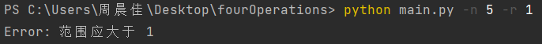
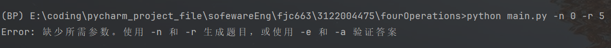
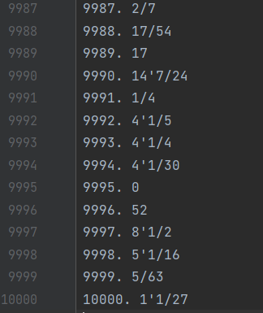

| 这个作业属于哪个课程 | [软件工程](https://edu.cnblogs.com/campus/gdgy/CSGrade22-34)                |
|------------|-------------------------------------------------------------------------|
| 这个作业要求在哪里  | [结对项目](https://edu.cnblogs.com/campus/gdgy/CSGrade22-34/homework/13230) |
| 这个作业的目标    | 与搭档共同完成四则运算自动生成程序,学习如何多人搭配完成项目                                          |
| 项目成员       | 范建成（3122004475），周晨佳（3122004631）                                         |
| github链接    | [https://github.com/fjc663/fjc663/tree/main/3122004475/fourOperations](https://github.com/fjc663/fjc663/tree/main/3122004475/fourOperations)|

---

## 一、PSP表

| PSP2.1                                  | Personal Software Process Stages | 预估耗时（分钟） | 实际耗时（分钟） |
|-----------------------------------------|----------------------------------|----------|----------|
| **Planning**                            | 计划                               | 20       | 30       |
| **Estimate**                            | 估计这个任务需要多少时间                     | 20       | 30       |
| **Development**                         | 开发                               | 820      | 850      |
| - Analysis                              | - 需求分析 (包括学习新技术)                 | 200      | 230      |
| - Design Spec                           | - 生成设计文档                         | 30       | 30       |
| - Design Review                         | - 设计复审                           | 50       | 50       |
| - Coding Standard                       | - 代码规范 (为目前的开发制定合适的规范)           | 20       | 25       |
| - Design                                | - 具体设计                           | 70       | 75       |
| - Coding                                | - 具体编码                           | 350      | 340      |
| - Code Review                           | - 代码复审                           | 40       | 50       |
| - Test                                  | - 测试（自我测试，修改代码，提交修改）             | 60       | 60       |
| **Reporting**                           | 报告                               | 85       | 90       |
| - Test Report                           | - 测试报告                           | 60       | 50       |
| - Size Measurement                      | - 计算工作量                          | 15       | 20       |
| - Postmortem & Process Improvement Plan | - 事后总结, 并提出过程改进计划                | 10       | 20       |
|                                         | **合计**                           | **925**  | **980**  |

---

## 二、效能分析


---

## 三、设计实现过程
**流程图**：


---

## 四、代码说明

### 代码共包含 11 个函数

1. **`main()`**  
   程序的入口，处理命令行参数并调用相应的功能。

2. **`generate_operator()`**  
   随机生成一个四则运算符（`+`, `-`, `×`, `÷`）。

3. **`format_fraction(frac)`**  
   格式化分数为可读的字符串，包括带分数和真分数。

4. **`generate_number(range_limit)`**  
   生成一个随机数或真分数，确保其在指定的范围内。

5. **`format_number(num)`**  
   将自然数或分数格式化为字符串。

6. **`insert_random_parentheses(expr)`**  
   在表达式中随机插入括号，以增加复杂性。

7. **`generate_expression(range_limit)`**  
   生成一个包含随机数和运算符的四则运算表达式，并随机插入括号。

8. **`fractionize_expression(expression)`**  
   将带分数或真分数字符串转换为 `fractions.Fraction` 对象。

9. **`calculate_answer(expression)`**  
   计算表达式的结果，返回分数形式的结果。

10. **`generate_problems(n, range_limit, exercise_file, answer_file)`**  
    生成指定数量的题目并将其写入练习和答案文件。

11. **`validate_answers(exercise_file, answer_file, result_file)`**  
    验证用户提供的答案，并统计正确和错误的题目。

### 代码实现图:


---

## 五、测试运行

### 测试用例 1：生成 10 个四则运算题目，数值范围为 10
```bash
python main.py -n 10 -r 10
```
**期望结果**: 生成 10 个题目并保存在 Exercises.txt，对应答案保存在 Answers.txt。
**测试结果**：
Exercises.txt:

``` 
1. 1'1/7 × 5 = 
2. 1/2 ÷ 9 × 1'1/5 ÷ 4 = 
3. 4 × 7 = 
4. (1/4 ÷ 1) ÷ 1 + 8 = 
5. 8 × 2 ÷ 4 + 1/3 = 
6. 8 × 1 ÷ 6 × 4 = 
7. 7 + 4 ÷ 9 + 1 = 
8. 8/9 + 4'1/2 + 5 = 
9. (5 - 1 - 1'1/8) - 1'1/7 = 
10. 5/7 ÷ 3/4 = 
```
Answers.txt:
```
1. 5'5/7
2. 1/60
3. 28
4. 8'1/4
5. 4'1/3
6. 5'1/3
7. 8'4/9
8. 10'7/18
9. 1'41/56
10. 20/21
```
### 测试用例 2：生成 15 个四则运算题目，数值范围为 15
```bash
python main.py -n 15 -r 15
```
**期望结果**: 生成 15 个题目并保存在 Exercises.txt，对应答案保存在 Answers.txt。
**测试结果**：
Exercises.txt:

``` 
1. 13 ÷ 1'4/9 × 11 = 
2. 2 + 1 = 
3. 6 × (1'1/3 × 2'1/4) ÷ 10 = 
4. 5 ÷ (2 × 5/6) + 13 = 
5. 7/13 × 4 + 5/11 = 
6. 10/13 ÷ 1/4 + 2'4/5 = 
7. 1'3/7 × 1'2/11 = 
8. 10 - 1/2 = 
9. (3/8 ÷ 1/12) ÷ 9 = 
10. 10 ÷ 1'1/3 = 
11. 9 ÷ 14 = 
12. 3/4 × 9 ÷ 1/12 + 14 = 
13. 1/3 + 5 = 
14. 1/4 ÷ (10/11 ÷ 8) × 7 = 
15. 7/9 ÷ (8 ÷ 1'2/9) × 1/9 = 
```
Answers.txt:
```
1. 99
2. 3
3. 1'4/5
4. 16
5. 2'87/143
6. 5'57/65
7. 1'53/77
8. 9'1/2
9. 1/2
10. 7'1/2
11. 9/14
12. 95
13. 5'1/3
14. 15'2/5
15. 77/5832
```
### 测试用例 3：生成 50 个四则运算题目，数值范围为 100
```bash
python main.py -n 50 -r 100
```
**期望结果**: 生成 50 个题目并保存在 Exercises.txt，题目中的数字在 1 到 100 之间。
**测试结果**：
Exercises.txt:
``` 
1. (11 - 23/28) ÷ 49 = 
2. 2 × 12 ÷ 44 × 89 = 
3. 84 - 73 = 
4. 9/91 ÷ 38/41 = 
5. 77 ÷ 1/7 × 3/32 = 
6. 91 - 3'1/2 ÷ 58 = 
7. (96 + 8 - 1'9/14) - 77 = 
8. 49/65 × (1'4/5 × 4'2/3) + 67 = 
9. 35 + 4/43 + 2'12/23 = 
10. (26 × 83) × 1'15/22 = 
11. 6'7/9 ÷ 49/62 = 
12. (1'26/55 ÷ 13) × 76 = 
13. 39/82 × 60 + 1'11/17 ÷ 41/70 = 
14. (53 + 1'19/71) × 5/23 - 11 = 
15. 36'1/2 × 1 × 77 = 
16. 40 - 1/4 ÷ 90 = 
17. 11/28 × 47 + 99 = 
18. 2'17/19 + 72 = 
19. 3/31 ÷ 24 = 
20. 19/87 × 21 = 
21. 78 ÷ 3/55 - 3 = 
22. 56 ÷ 8 = 
23. 12 + 34 × 15 × 59 = 
24. (1 ÷ 3'1/2) ÷ 14 = 
25. (12 × 7) + 1'1/97 = 
26. 75 × (9'4/5 × 5'3/5) + 5'4/15 = 
27. 73 + 44 × 19/63 = 
28. 80 - 74 + 26 × 2'9/31 = 
29. (94 + 65) + 24/43 = 
30. 44 - 49/87 = 
31. 1'3/17 + 2/41 × 18 + 99 = 
32. 14 + 1'20/29 × 2'1/9 - 1'28/43 = 
33. 23/52 × 3'3/22 = 
34. 14/25 + 93 - 84 = 
35. 42 - 61/83 - 79/82 + 41 = 
36. 56 + 1'15/83 ÷ 83 = 
37. 10/17 ÷ 1'9/85 + 79 × 3'5/8 = 
38. 19/27 ÷ 15 × 51 = 
39. 35 + 4 = 
40. 82 + 86 = 
41. 16 + 1'39/49 = 
42. 73/77 + 1/28 = 
43. 99 + 82 = 
44. 52 ÷ 95 = 
45. 6 × 22/27 + 17/86 = 
46. 1'13/16 + 59 ÷ 12/25 ÷ 78/83 = 
47. 2'13/27 + 3'3/26 ÷ 98 - 1'17/22 = 
48. 58 ÷ 81 = 
49. 17/65 + 2'7/23 ÷ 34/43 = 
50. 1'1/42 + (22/97 + 38) ÷ 1'17/26 = 
```
Answers.txt:
```
1. 285/1372
2. 48'6/11
3. 11
4. 369/3458
5. 50'17/32
6. 90'109/116
7. 25'5/14
8. 73'108/325
9. 37'608/989
10. 3629'4/11
11. 8'254/441
12. 8'436/715
13. 31'243/697
14. 1302/1633
15. 2810'1/2
16. 39'359/360
17. 117'13/28
18. 74'17/19
19. 1/248
20. 4'17/29
21. 1427
22. 7
23. 30102
24. 1/49
25. 85'1/97
26. 4121'4/15
27. 86'17/63
28. 65'17/31
29. 159'24/43
30. 43'38/87
31. 101'38/697
32. 15'10279/11223
33. 1'443/1144
34. 9'14/25
35. 81'2053/6806
36. 56'98/6889
37. 286'341/376
38. 2'53/135
39. 39
40. 168
41. 17'39/49
42. 303/308
43. 181
44. 52/95
45. 5'67/774
46. 132'1139/1872
47. 560411/756756
48. 58/81
49. 3'8939/50830
50. 24'24121/175182
```
### 测试用例 4：验证答案
```bash
python main.py -e Exercises.txt -a myAnswers.txt
```
**期望结果**: 验证 Exercises.txt 和 Answers.txt 中的题目与答案是否匹配，正确和错误统计保存在 Grade.txt。

**测试结果**：
(Exercises.txt和Answers.txt与测试用例2中生成的文件相同)

**可以发现，我们自己手动填写的myAnswer.txt文件中，第三题与第五题的答案错误**。（与Answer.txt不相符）
myAnswer.txt:

``` 
1. 112
2. 4123/54672
3. 69
4. 90'76/77
5. 75'35/58
```
Grade.txt:
```
Correct: 3 (1, 2, 4)
Wrong: 2 (3, 5)
```
### 测试用例 5：数值范围为 1（无效范围）
```bash
python main.py -n 5 -r 1
```
**期望结果**: 输出错误提示 "Error: 范围应大于1"，不会生成题目。
**测试结果**:

### 测试用例 6：题目数量为 0（无效数量）
```bash
python main.py -n 0 -r 5
```
**期望结果**: 输出错误提示，不会生成题目。
**测试结果**:


### 测试用例 7：题目数量为 20.5（无效数量）
```bash
python main.py -n 20.5 -r 10
```
**期望结果**: 输出错误提示，不会生成题目。
**测试结果**:


### 测试用例 8：生成 10000 个四则运算题目，数值范围为 10
```bash
python main.py -n 10000 -r 10
```
**期望结果**: 生成 10000 个题目并保存在 Exercises.txt，对应答案保存在 Answers.txt。

**测试结果**：Exercises.txt:


Answers.txt:


### 测试用例 9：没有提供正确类型的输入
```bash
python main.py -n 100
```
**期望结果**: 提示缺少正确的输入。并说明应该输入哪些参数
**测试结果**：


### 测试用例 10：图形化界面的运行

#### 生成题目与答案：

分别输入题目数量和数值范围：


依次点击"生成题目"与"生成答案"（可以点击"保存题目"或"保存答案"将题目或答案另存为文本文件）：


#### 验证答案：

分别选择题目文件和答案文件:


点击"验证答案"(可选择是否将验证结果另存为文本文件):


### 为什么程序是正确的

- **运算正确性**: 程序使用 fractions.Fraction 确保了分数计算的准确性，避免了浮点数计算误差。
- **错误处理**: 通过处理 ZeroDivisionError 和数值范围限制，避免了非法运算。
- **验证结果**: 自动生成的题目和答案已经通过匹配验证，确保了输出答案的准确性。
- **格式化输出**: 程序对分数和带分数进行了正确的格式化，并验证了这些格式化结果是否符合预期。


## 六、项目小结
我们都是第一次合作编程，之前习惯了独立完成项目,开始有些不适应，但在经历了一段时间的磨合之后，交流的效率逐渐变高,我们也慢慢发现了多人完成项目的优势,在编码时,遇到bug可以一起解决,可以更快的解决bug,极大的加速了编码的速度.在编写博客时,我们选择了根据不同模块分工行动.总的来说,组队完成项目,可以减少编码错误,加快项目的完成速度,提高项目完成质量.我们两人都受益匪浅.